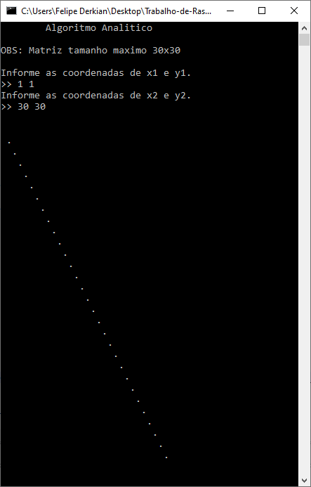
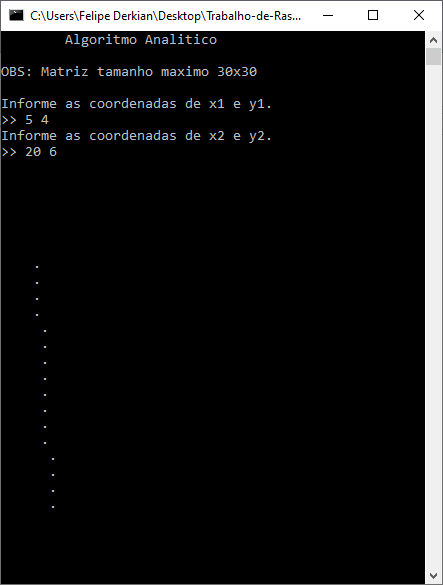
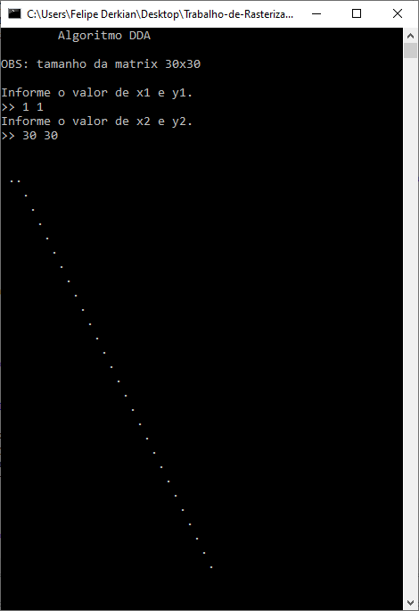
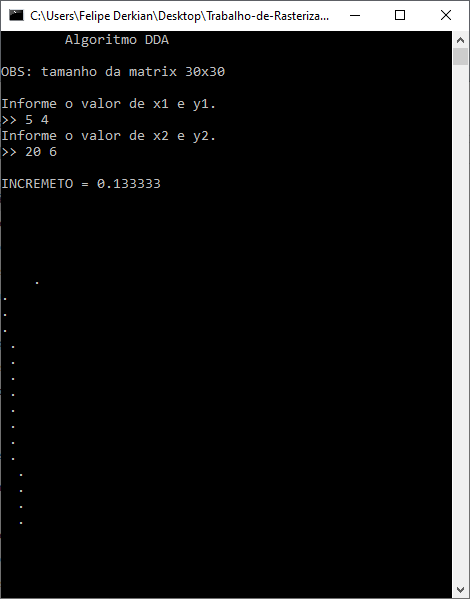
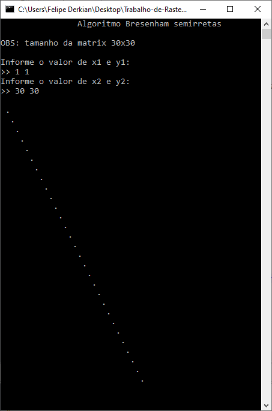
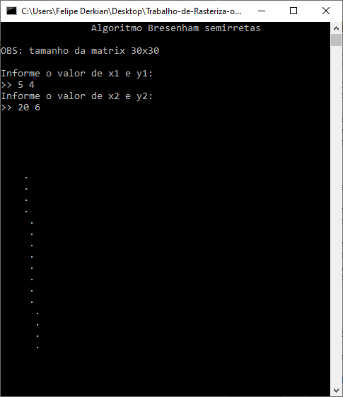

# RASTERIZAÇÃO DE RETAS COM MÉTODO _ANALÍTICO_, _DDA_ (ANALISADOR DIFERENCIAL DIGITAL) E _BRESENHAM_

## ALGORITMO MÉTODO ANALÍTICO

O algoritmo método analítico é um algoritmo usado para rasterização de semirretas onde dados dois pontos p1(x1,y1) e p2(x2,y2), ele rasteriza na escolha dos melhores pixel usado para isso como base a equação da reta que é dada por y=mx+b . onde m=(y2-y1)/(x2-x1), ou seja m=(delta_y/delta_x) e b=y1-mx1. Sabendo-se disso, basta substituir na fórmula da equação da reta para termos os pontos.

### PONTOS FORTES DO MÉTODO ANALÍTICO

O método analítico é um excelente algoritmo para rasterizar semirretas que fiquem no primeiro octante que vai de 0° a 45°. Pois para retas com inclinação abaixo de 45° fica muito satisfatório por exemplo os pontos p1(0,0) e p2(5,2) onde a reta não tem muita inclinação.

### PONTOS FRACOS DO MÉTODO ANALÍTICO

O método analítico quando utilizado para retas com mais de 45°, ou seja segundo octante, começa a ter falhas na reta ficando impraticável o uso do algoritmo, como no caso de teste usando os pontos p1(0,0) e p2(2,5), onde a reta tem muita inclinação e acontece falhas por conta dos arredondamentos de ponto flutuante.

### DESEMPENHO DO ALGORITMO MÉTODO ANALÍTICO

O algoritmo é pouco eficiente, pois usa muito ponto flutuante e arredondamentos que são operações complexas e custosas para o computador processar. Para desenhar uma reta pode ser uma boa opção, mas quando precisamos rasterizar centenas de linhas passa não ser interessante visto que em certos cenários existem centenas de linhas.

### PSEUDO CÓDIGO

```
Função metodoAnalitico recebe os pontos x1,y1,x2,y2:
  se x1 for igual a x2 faça
    para y de y1 ate y2
    setPixel(x1,y, cor)
  senão
    m = delta y / delta x
    b = y2-m*x2
    para x de x1 ate x2
      y = m*x+b
      setPixel(x,y,cor)
```


### CÓDIGO EM LINGUAGEM C
```
void metodoAnalitico(int matrix[TAM_MATRIX][TAM_MATRIX], int x1, int y1, int x2, int y2){
  int y;
  if(x1==x2){
    for(y=y1 ; y<=y2; y++)
    matrix[x1][y] = BORDA;
  }else{
    double m = (double) (y2-y1) / (x2-x1);
    double b = (double) y2-m*x2;
    int x;
    for(x=x1 ; x<=x2 ; x++){
      double k = (double) m*x+b;
      y = round(k);
      matrix[x][y] = BORDA;
    }
  }
}
```

### IMAGENS





---

## ALGORITMO DDA (ANALISADOR DIFERENCIAL DIGITAL)

O algoritmo DDA analisador diferencial digital, veio para melhorar os resultados do método analítico como a falha que acontece quando a inclinação da reta é maior que 45°. Ele usa técnica baseada no calculo de delta X e delta Y, onde m=delta_y/delta_X, delta_y=m*delta_X e
delta_X=delta_y/m.

A ideia é parecida com a implementada no método analítico quando se trabalho entre 0 a 45°, mas quando estamos trabalhando entre 45 a 90° modifica-se o incremento para delta_y e calculase os sucessivos valores para x, com isso resolve-se o problema das retas falhadas com inclinação maior que 45°.


### PONTOS FORTES DO DDA

Os pontos fortes do DDA em relação ao método analítico é que ele resolve o problema das semirretas com inclinação maiores que 45°, onde no método analítico ficavam falhadas e com um simples ajuste trocando quem incrementa com os sucessivos valores conseguiram resolver o
problema das falhas.

### PONTOS FRACOS DO DDA

Apesar de ter solucionado o problema de semirretas com inclinação maior que 45°, ainda continua com operações custosas e pesadas para o computador realizar milhões de vezes por segundo como ponto flutuante e arredondamento.


### DESEMPENHO DO ALGORITMO DDA

O desempenho é melhor que do método analítico, mas ainda utiliza aritmética com ponto flutuante, arredondamentos e em grande escala acaba sendo lento pois são operações custosas para o computador processar.


### PSEUDO CÓDIGO
```
Função DDA recebe os pontos x1, y1, x2, y2:
  verifica-se qual é maior delta_x ou delta_y faça:
    incremento = delta_y/delta_x
    y = y1
    para x de x1 até x2 faça:
      setPixel(x,y,cor)
      y = y + incremento
  senão faça:
    incremento = delta_x/delta_y
    x=x1
    para y de y1 até y2 faça:
      setPixel(x,y,cor)
      x = x + incremento
```

### DDA EM LINGUAGEM C
```
void algoritmo_dda(int matrix[TAM_MATRIX][TAM_MATRIX], int x1, int y1, int x2, int y2){

  int abs_x = x2-x1;
  abs_x = abs(abs_x); //pega o valor abs do delta x
  int abs_y = y2-y1;
  abs_y = abs(abs_y); //pega o valor abs do delta y
  double incremento=0, totalIncrementos=0;
  int x , y;
  
  if(abs_x > abs_y){
    incremento = (double) (y2-y1) / (x2-x1);
    y = y1;
    
    for(x=x1 ; x<=x2 ; x++){
      //simula ligar o pixel
      matrix[x][y] = BORDA;
      totalIncrementos = totalIncrementos + incremento;
      y = round(totalIncrementos);
    }
  }else{
  
    incremento = (double) (x2-x1) / (y2-y1);
    x = x1;
    
    for(y=y1 ; y<=y2 ; y++){
      //simula ligar o pixel
      matrix[x][y] = BORDA;
      totalIncrementos = totalIncrementos + incremento;
      x = round(totalIncrementos);
    }
  }
}

```

### IMAGENS





---

## ALGORITMO BRESENHAM PARA SEMIRRETAS

A ideia do algoritmo de Bresenham é analisar qual o próximo pixel que será ligado. Como pixel é discreto de um ponto p1 para um ponto p2 ele analisa qual pixel vizinho ele deve ligar por exemplo o (x+1,y) ou (x+1,y+1). Ou seja, fazendo uma análise com a inclinação da reta tirando a diferença entre os pixel ao ponto da semirreta, ele consegue determinar qual pixel acender ou não.

### PONTOS FORTES DO ALGORITMO DE BRESENHAM

O algoritmo de Bresenham é muito bom pois é leve e consegui fazer linha perfeitas por usar uma técnica que analisa o próximo pixel da vizinhança ao qual deve acender. Diferente dos outros algoritmos que usavam métodos matemáticos de geometria analítica e arredondamentos. 

Um ponto que merece destaque para o Bresenham, é que ele consegue rasterizar tanto p1 > p2 quanto p2 > p1. Nos outros algoritmos não conseguiam o mesmo resultado. 

### DESEMPENHO DO ALGORITMO DE BRESENHAM

O algoritmo de Bresenham, é muito eficiente pois trabalha apenas com aritmética de inteiros e não precisa de arredondamentos, ou seja apenas operações que o computador sabe fazer muito bem e com eficiência. Sendo muito mais eficiente que os outros algoritmos por essas características.


### PSEUDO CÓDIGO

```
Função Bresenham recebe x1,y1,x2,y2:
  tira o delta_x, delta_y
  y=y1
  parâmentro = 2*delta_y-delta_x
  para x de x1 até x2 faça:
    setPixel(x,y,cor)
    se parâmetro for maior ou igual 0 faça:
      y = y+1
      parâmetro = parâmetro + 2*(delta_y – delta_x)
    senão faça:
      parâmetro = parâmetro + 2*delta_y
```

### BRESENHAM EM LINGUAGEM C

```
void bresenham_line(int matrix[TAM_MATRIX][TAM_MATRIX], int x0,int y0, int x1, int y1){

  int delta_x = abs(x0-x1);
  int delta_y = abs(y0-y1);
  int parametro = 2*delta_y-delta_x;
  int parametro2 = 2*delta_y;
  int xy2 = 2*(delta_y-delta_x);
  int xf,x,y;
  
  if(x0 > x1){
    x = x1;
    y = y1;
    xf = x0;
    matrix[x][y] = BORDA;
  }else{
    x = x0;
    y = y0;
    xf = x1;
    matrix[x][y] = BORDA;
  }
  
  while(x < xf){
    x = x+1;
    if(parametro < 0){
      parametro = parametro + parametro2;
    }else{
      y = y+1;
      parametro = parametro + xy2;
    }
    matrix[x][y] = BORDA;
  }
}
```

### IMAGENS





---

## CONCLUSÃO

Vimos como o método analítico tinham suas falhas, o DDA resolveu as falhas que o método analítico apresenta, mas ainda era muito pesado por precisar de operações custosas para o computador como aritmética de ponto flutuante e arredondamentos. Então, Bresenham criou seu
algoritmo que além de muito inteligente é muito eficiente computacionalmente, e resolve os problemas dos outros algoritmos anteriores.


# OBRIGADO PELA ATENÇÃO!
